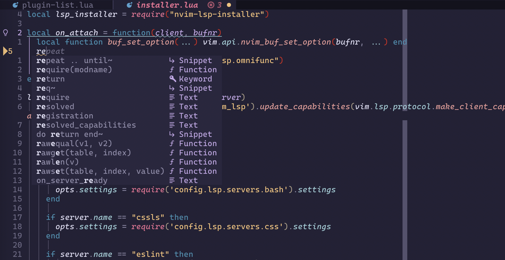

# nvim init.lua

 

## Prerequisites

* [Neovim](http://neovim.io/) 0.5+
* [ripgrep](https://github.com/BurntSushi/ripgrep) is required for string search
  in Telescope
* [Read this](https://github.com/tree-sitter/tree-sitter-haskell#building-on-macos) 
  if you are using this config on a Mac, or just disable `tree-sitter-haskell` 
  in the config
* [NerdFont](https://www.nerdfonts.com/font-downloads) with ligature support for
  the status line. I use [Delugia Code](https://github.com/adam7/delugia-code)
* `xclip`/`xsel` required on Linux for access to the global clipboard

## Getting started

***NOTE:*** Use the tagged releases for a more stable version of the config, the
git branch might be unstable

* clone repo
* symlink init.lua & lua folder to your nvim config folder, by default:
  ```bash
  ln -s ~/<this repo location>/init.lua ~/.config/nvim/init.lua
  ln -s ~/<this repo location>/lua ~/.config/nvim/lua
  ```
* if they exist, remove `packer_compiled.lua` from `~/.config/nvim/plugin` or
  `~/.config/nvim/plugin` and `~/.local/share/nvim/site/`. If you don't want to 
  bother with this check the [Troubleshooting](#troubleshooting) section
* run `nvim --headless -u install.lua -c 'autocmd User PackerComplete quitall'`
* open nvim as normal
* enjoy!

## Keybindings

### Generic actions

| Keys                      | Action                                |
| ------------------------- | --------------------------------      |
| `<Space>o`                | Open file search                      |
| `<Space>s`                | Reload nvim config                    |
| `<Space>t`                | Show file diagnostics                 |
| `<Tab>`/`<Shift><Tab>`    | navigate autocomplete                 |
| `<Space>y`/`<Space>p`     | copy-paste to global clipboard        |
| `<Space>c`                | Colorschemes                          |
| `<Space>f`                | Search for word in folder             |
| `h`                       | Hop to word                           |
| `l`                       | Hop to line                           |
| `<Ctrl>l`                 | Clear highlighted text                |
| `:Q`                      | Close nvim with all open buffers      |
| `:q`                      | Close current buffer                  |
| `:W`/`:w`                 | Save current buffer                   |
| `J`                       | Move down selected line (visual only) |
| `K`                       | Move up selected line (visual only)   |

### LSP
| Keys                      | Action                           |
| ------------------------- | -------------------------------- |
| `<Space>fo`               | Format buffer with LSP           |
| `gca`                     | Code actions                     |
| `gd`                      | Go to definition                 |
| `gh`                      | Display hover tooltip            |
| `gD`                      | Go to implementation             |
| `gt`                      | Go to type definition            |
| `gr`                      | References                       |
| `gR`                      | Rename all references            |
| `<Ctrl>k`                 | Function signature help          |

## Troubleshooting

#### Installation failed
If the installation failed you can just open nvim with `nvim -u install.lua` and
just run `:PackerSync` manually. This can also be ran if you currently have a
Packer based config and don't want to manually delete the plugin folder.

## Special Thanks
* [NvChad](https://nvchad.github.io/)
* [Ecovim](https://github.com/ecosse3/nvim)
