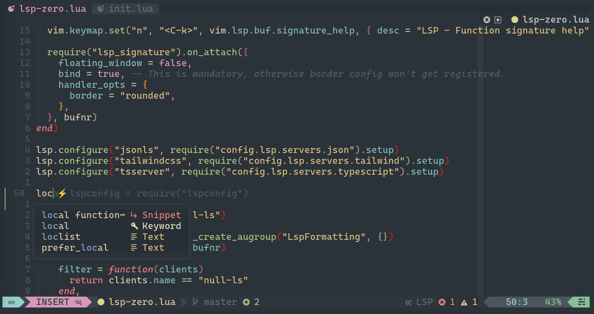

# nvim init.lua



## Prerequisites

- [Neovim](http://neovim.io/) 0.8+
- [ripgrep](https://github.com/BurntSushi/ripgrep) is required for string search
  in Telescope
- [NerdFont](https://www.nerdfonts.com/font-downloads) with ligature and powerline
  support for the status line. I use [Delugia Code](https://github.com/adam7/delugia-code)
- `xclip`/`xsel` required on Linux for access to the global clipboard

## Getting started

**_NOTE:_** Use the tagged releases for a more stable version of the config, the
git branch might be unstable

- clone repo
- symlink init.lua & lua folder to your nvim config folder, by default:
  ```bash
  ln -s ~/<this repo location>/init.lua ~/.config/nvim/init.lua
  ln -s ~/<this repo location>/lua ~/.config/nvim/lua
  ```
- open nvim as normal
- (optional) restart your neovim to make sure everything is using the proper config
- enjoy!

**_NOTE:_** Both LSP config and null-ls are based on my needs and requirements,
update them for your needs in the `lua/config/lsp-zero.lua` file.

## Keybindings

### Generic actions

| Keys                   | Action                                |
| ---------------------- | ------------------------------------- |
| `<Space>o`             | Open file search                      |
| `<Space>t`             | Show file diagnostics                 |
| `<Tab>`/`<Shift><Tab>` | navigate autocomplete                 |
| `<Space>y`/`<Space>p`  | copy-paste to global clipboard        |
| `<Space>c`             | Colorschemes                          |
| `<Space>g`             | Search for word in folder             |
| `<Space>f`             | Show file navigator                   |
| `<Space>b`             | Show open buffers                     |
| `h`                    | Hop to word                           |
| `l`                    | Hop to line                           |
| `<Ctrl>l`              | Clear highlighted text                |
| `:Q`                   | Close nvim with all open buffers      |
| `:q`                   | Close current buffer                  |
| `:W`/`:w`              | Save current buffer                   |
| `J`                    | Move down selected line (visual only) |
| `K`                    | Move up selected line (visual only)   |

### LSP

| Keys        | Action                  |
| ----------- | ----------------------- |
| `<Space>fo` | Format buffer with LSP  |
| `gca`       | Code actions            |
| `gd`        | Go to definition        |
| `gh`        | Display hover tooltip   |
| `gD`        | Go to implementation    |
| `gt`        | Go to type definition   |
| `gr`        | References              |
| `gR`        | Rename all references   |
| `<Ctrl>k`   | Function signature help |

## Troubleshooting

## Special Thanks

- [r/neovim](https://www.reddit.com/r/neovim/)
- [NvChad](https://nvchad.github.io/)
- [Ecovim](https://github.com/ecosse3/nvim)
